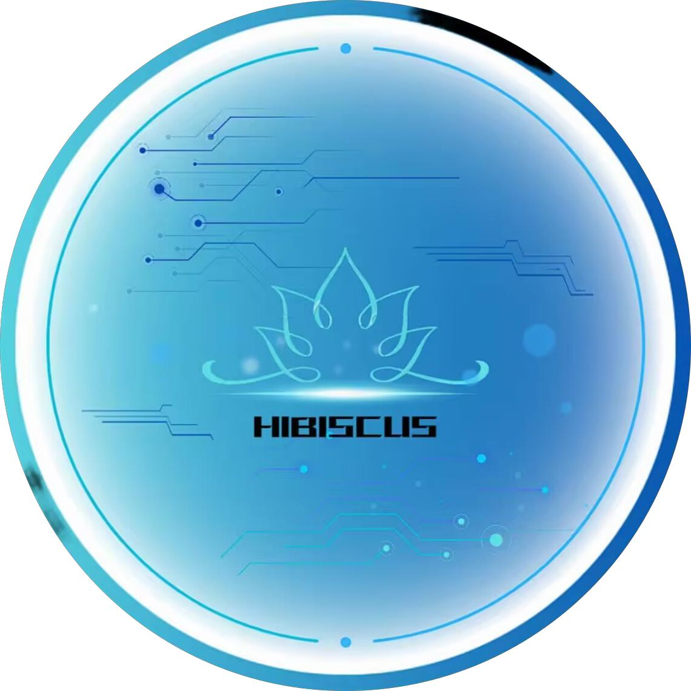

# Hibiscus Signal

<p align="center">
    
    <br>      
    <br>
</p>

[](https://central.sonatype.com/artifact/io.github.heathcetide/cetide.hibiscus.signal)
[](LICENSE)

轻量级、高扩展的Spring事件驱动框架，提供完整的信号处理生命周期管理，支持拦截器链、过滤器链、转换器链等企业级特性。

-----------------------------------------------------------------------------------------------

## ✨ 特性

- **注解驱动** - 通过`@SignalEmitter`和`@SignalHandler`快速定义事件
- **全链路管理** - 支持拦截器、过滤器、转换器组成的处理管道
- **上下文传递** - 内置`SignalContext`实现跨处理器数据共享
- **异步处理** - 基于线程池的异步事件处理，支持自定义线程池
- **监控统计** - 内置Metrics统计事件处理指标
- **优先级控制** - 多级优先级处理机制
- **Spring生态整合** - 完美兼容Spring Boot自动配置

## 📦 安装

Maven 依赖：
```xml
<dependency>
    <groupId>io.github.heathcetide</groupId>
    <artifactId>cetide.hibiscus.signal</artifactId>
    <version>1.0.5</version>
</dependency>
```

## 🚀 快速开始

### 1. 定义事件发射器
```java
@RestController
public class AuthController {

    @PostMapping("/login")
    @SignalEmitter(USER_LOGIN_EVENT) // 标记为登录事件发射点
    public String login(@RequestBody LoginRequest request, HttpServletRequest httpRequest) {
        // ...登录逻辑
        SignalContextCollector.collect("loginUser", user); // 收集中间数据
        SignalContextCollector.collect("httpRequest", httpRequest);
        return jwtToken;
    }
}
```

### 2. 定义事件处理器
```java
@Component
public class UserEventHandler {
    
    @SignalHandler(
        value = USER_LOGIN_EVENT,
        target = UserEventHandler.class,
        methodName = "handleLogin",
        async = true
    )
    public void handleLogin(SignalContext context) {
        User user = (User) context.getIntermediateValues().get("loginUser");
        // 发送欢迎邮件等后处理逻辑
    }
}
```

### 3. 自定义线程池（可选）
```java
@Configuration
public class SignalExecutorConfig {

    @Bean("signalExecutor")
    public ExecutorService signalExecutor() {
        return new ThreadPoolExecutor(
            6, 12, 60, TimeUnit.SECONDS,
            new LinkedBlockingQueue<>(500),
            new CustomThreadFactory("signal-pool"),
            new ThreadPoolExecutor.CallerRunsPolicy()
        );
    }
}
```

## 🛠️ 高级功能

### 拦截器示例（操作日志）
```java
@Component
@SignalInterceptorBind({USER_LOGIN_EVENT, USER_LOGOUT_EVENT})
public class AuditInterceptor implements SignalInterceptor {

    @Override
    public boolean beforeHandle(String event, Object sender, Object... params) {
        SignalContext context = (SignalContext) params[0];
        HttpServletRequest request = (HttpServletRequest) context.getIntermediateValues().get("httpRequest");
        
        // 记录审计日志
        log.info("用户操作事件: {} from IP: {}", event, request.getRemoteAddr());
        return true;
    }
}
```

### 过滤器示例（权限校验）
```java
@Component
@SignalFilterBind("security.*")
public class SecurityFilter implements SignalFilter {

    @Override
    public boolean filter(String event, Object sender, Object... params) {
        SignalContext context = (SignalContext) params[0];
        return checkPermission(context.getAttributes());
    }
}
```

### 转换器示例（数据脱敏）
```java
@Component
@SignalTransformerBind("user.*")
public class DataMaskTransformer implements SignalTransformer {

    @Override
    public Object[] transform(String event, Object sender, Object... params) {
        User user = (User) params[0];
        user.setPassword("******");
        return new Object[]{user};
    }
}
```

## 📊 监控指标
通过`SignalMetrics`获取处理统计：
```java
@Autowired
private Signals signals;

public void showMetrics() {
    Map<String, Map<String, Object>> metrics = signals.getMetrics().getAllMetrics();
    metrics.forEach((event, stats) -> {
        System.out.println(event + " - 处理次数: " + stats.get("emitCount"));
    });
}
```

## ⚙️ 配置参数

| 参数项               | 默认值     | 说明                     |
|---------------------|-----------|------------------------|
| signal.async        | true      | 是否启用异步处理          |
| signal.max-retries  | 3         | 最大重试次数             |
| signal.timeout      | 5000      | 处理超时时间(ms)         |
| signal.pool.core    | 4         | 核心线程数               |
| signal.pool.max     | 8         | 最大线程数               |


## 📜 版本历史

### v1.0.4 (2024-05-20) 🚀
**新特性**
- 支持通过`@SignalInterceptorBind`、`@SignalFilterBind`、`@SignalTransformerBind`注解自动注册组件
- 增加线程池自定义配置能力

### v1.0.3 (2024-04-15) 🔧
- 新增信号上下文收集器(SignalContextCollector)
- 初始化注册使用ApplicationReadyEvent，解决初期循环依赖问题
- 解决初始化SignalHandler时，中间传输值为null的问题
- 修复内置线程池无法识别问题

### v1.0.2 (2024-03-10) 🎯
- 基础事件处理框架发布
- 实现同步/异步双模式处理
- 支持多级优先级控制
- 提供Spring基础整合能力
- 内置默认线程池配置

### v1.0.1 (2024-02-01) 🛠
- 核心信号处理框架搭建
- 基础API设计（SignalHandler/SignalEmitter）
- 实现基本事件绑定与触发机制
- 提供简单指标统计功能


## 📄 许可证

本项目采用 [MIT License](LICENSE)，详情请见许可证文件。